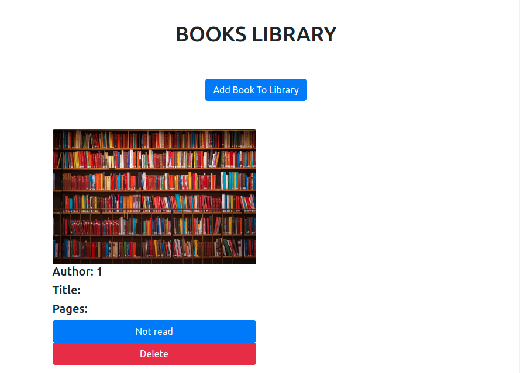

# Library - Javascript

> Library in JavaScript is a practice project, which includes the user input functionality and managing the dynamically DOM manipulation. We used Javascript, HTML5, CSS3, Bootstrap to implement it.

## Live Link Demo

[Live Link Demo](https://railona.github.io/library/)

## Built With

- HTML5
- CSS3
- Bootsrap
- JavaScript

## Getting Started

To get a local copy up and running follow these simple example steps.

### Prerequisites

- Text Editor (VSCode is suggested.)
- Git installed 

### Setup

- Open Terminal
- In your prefered folder, run `git clone git@github.com:RailonA/library.git`
- Open the `index.html` in the folder to run the project

To make any change,

- Open related file by using text editor.

## Authors

👤 **Railon Acosta**
- GitHub: [@railonA](https://github.com/RailonA)
- Linkedin: [@railonAcosta](https://www.linkedin.com/in/railon-acosta-81265180/)
- Twitter: [@railonAcosta](https://twitter.com/RailonAcosta)

👤 **Rashad Muntar**

- GitHub: [@Rashad-Muntar](https://github.com/Rashad-Muntar)
- Twitter - [@RashadToure](https://twitter.com/RashadToure)
- LinkedIn: [Rashad Muntar](https://www.linkedin.com/in/rashad-muntar/)

## 🤝 Contributing

Contributions, issues and feature requests are welcome! Start by:

- Forking the project
- Cloning the project to your local machine
- `cd` into the project directory
- Run `git checkout -b your-branch-name`
- Make your contributions
- Push your branch up to your forked repository
- Open a Pull Request with a detailed description to the development branch of the original project for a review

## Show your support

Give a ⭐️ if you like this project!

## Acknowledgments

- Project originally taken from The Odin Project

## 📝 License

This project is [MIT](LICENSE) licensed.
